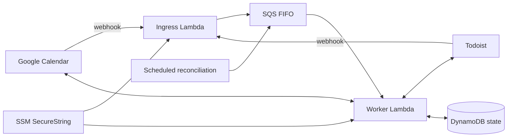

# todoist-calendar-sync

AWS-hosted, bidirectional Google Calendar ↔ Todoist synchronization with durable mapping state, reconciliation, recurrence handling and guarded human intervention.

The repository owns the application, tests, AWS SAM/CloudFormation infrastructure and GitHub Actions deployment. The former service name `gcp-app2-sync` is legacy terminology and is retained only where migration compatibility requires it.

## Architecture



Provider webhooks validate the incoming request and enqueue a sanitized delivery. The worker owns provider mutations and durable completion state. Reconciliation uses the same FIFO path, so repair work is serialized with normal changes.

The worker intentionally runs at reserved concurrency `1` while cross-profile moves can touch more than one sync profile. Do not raise worker concurrency until those operations have explicit cross-profile coordination.

## Runtime safety

The service includes:

- FIFO ordering and durable completion markers;
- Calendar incremental sync-token recovery;
- Todoist and Calendar recurrence handling;
- conservative reconciliation mutation budgets;
- circuit breakers for mutation storms;
- DynamoDB deletion protection and point-in-time recovery;
- a FIFO dead-letter queue with operational logging/alarms;
- optional Slack-backed manual intervention for decisions that are unsafe to guess.

Provider credentials and webhook secrets are never stored in this repository.

## Configuration

### Profile routing

Environment-specific provider identifiers are supplied through `SYNC_PROFILE_CONFIG_JSON` rather than committed to source. It must contain the three runtime profile keys used by the existing production state:

```json
{
  "home": {
    "calendarId": "home@example.invalid",
    "channelId": "example-home-channel",
    "todoistRoute": "/todoist-home",
    "todoistProjectId": "example-home-project"
  },
  "antonio": {
    "calendarId": "personal@example.invalid",
    "channelId": "example-personal-channel",
    "todoistRoute": "/todoist-personal",
    "todoistProjectId": "example-personal-project"
  },
  "work": {
    "calendarId": "work@example.invalid",
    "channelId": "example-work-channel",
    "todoistRoute": "/todoist-work",
    "todoistProjectId": "example-work-project"
  }
}
```

The values above are synthetic examples. Do not commit production routing values.

### Secrets

Production project secrets are AWS Systems Manager Parameter Store `SecureString` values under:

```text
/todoist-calendar-sync/calendar-watch-token
/todoist-calendar-sync/todoist-webhook-secret
/todoist-calendar-sync/proxy-shared-secret
/todoist-calendar-sync/google/home
/todoist-calendar-sync/google/antonio
/todoist-calendar-sync/google/work
/todoist-calendar-sync/todoist/home
/todoist-calendar-sync/todoist/antonio
/todoist-calendar-sync/todoist/work
```

The Slack bot token is shared infrastructure and currently remains at:

```text
/lambdas/shared/slack-bot-token
```

Normal deployments pass **parameter names**, not plaintext secret values. Secret rotation is a separate operator action.

## Development

Requirements:

- Node.js 22+
- npm
- AWS SAM CLI for infrastructure validation/builds

Install and run the test suite:

```bash
npm ci
npm test
```

Validate/build the SAM application:

```bash
sam validate --lint
PATH="$PWD/node_modules/.bin:$PATH" sam build
```

Run the public-source boundary check:

```bash
bash scripts/check-public-source.sh
```

Generated `dist/`, `.aws-sam/`, local `.env` files and migration configuration are intentionally ignored.

## CI

Pull-request CI requires no AWS credentials and no production secrets. It performs:

```text
npm ci
npm test
scripts/check-public-source.sh
sam validate --lint
sam build
```

This is deliberately safe for pull requests from forks when the repository is public.

## Deployment

Production GitHub Actions uses a protected environment named `production` and GitHub OIDC to assume:

```text
GitHubActionsTodoistCalendarSyncDeployRole
```

The deployment workflow has `contents: read` and `id-token: write`; it does not use long-lived AWS access keys or Bitwarden.

Expected protected environment configuration:

```text
AWS_REGION=eu-west-2
AWS_ROLE_TO_ASSUME=<OIDC deployment role ARN>
CODE_BUCKET=<SAM artifact bucket>
STACK_NAME=todoist-calendar-sync
RESOURCE_NAME_PREFIX=todoist-calendar-sync
SSM_PREFIX=/todoist-calendar-sync
TODOIST_CALENDAR_SYNC_SLACK_CHANNEL=<Slack channel ID>
SYNC_PROFILE_CONFIG_JSON=<profile routing JSON>
TODOIST_CALENDAR_SYNC_BILLING_ALARM_EMAIL=<optional email>
```

Bootstrap/update the deployment role with a privileged AWS identity:

```bash
AWS_REGION=eu-west-2 bash infrastructure/bootstrap-deployment-role.sh
```

The bootstrap script writes progress to stderr and emits only the deployment-role ARN on stdout so callers may safely capture it.

Normal production deployment runs only after successful `master` CI (or explicit `workflow_dispatch`) and is concurrency-controlled.

## Legacy production rename

Production historically used the name `gcp-app2-sync`. Do not rename the CloudFormation stack or stateful resources by simply changing `STACK_NAME`/`RESOURCE_NAME_PREFIX`.

The controlled migration is documented in:

[`docs/production-rename.md`](docs/production-rename.md)

Useful read-only/migration commands:

```bash
# Preview the SSM namespace migration
bash scripts/migrate-ssm-prefix.sh --dry-run

# Copy SecureString values to the canonical namespace
bash scripts/migrate-ssm-prefix.sh

# Verify state/queues/SSM before a production naming cutover
bash scripts/preflight-production-rename.sh
```

The old SSM parameters and old state table are retained until the canonical implementation has passed production verification and rollback is no longer required.

## Mapping compatibility

New Todoist mapping comments use:

```text
todoist-calendar-sync:mapping:v1
```

The reader also accepts the legacy marker during migration so existing external mappings are not orphaned.

## Operations

For manual intervention behavior see [`MANUAL-INTERVENTION.md`](MANUAL-INTERVENTION.md).

For project-comment migration behavior see [`PROJECT-COMMENT-MIGRATION.md`](PROJECT-COMMENT-MIGRATION.md).

For DynamoDB capacity decisions see [`PROVISIONED-CAPACITY-PLAN.md`](PROVISIONED-CAPACITY-PLAN.md).

A worker failure emits a structured `delivery_failed_for_dlq` record before the failed SQS message is quarantined. Search CloudWatch by SQS message ID or delivery ID when diagnosing DLQ items.

## Public-source policy

This repository must not contain:

- provider credentials or tokens;
- AWS access keys/private keys;
- production `.env` files;
- local SSM migration configuration;
- Node-RED runtime/credential/state backups from the superseded implementation;
- generated build output.

`scripts/check-public-source.sh` enforces the source-tree boundary. Before changing repository visibility, the **entire reachable Git history** must also be scanned and any historically exposed credential rotated/revoked. See issue #1 for the public-readiness gate.

## Contributing and security

See [`CONTRIBUTING.md`](CONTRIBUTING.md) for development/PR expectations and [`SECURITY.md`](SECURITY.md) for vulnerability reporting guidance.

## License

MIT. See [`LICENSE`](LICENSE).
